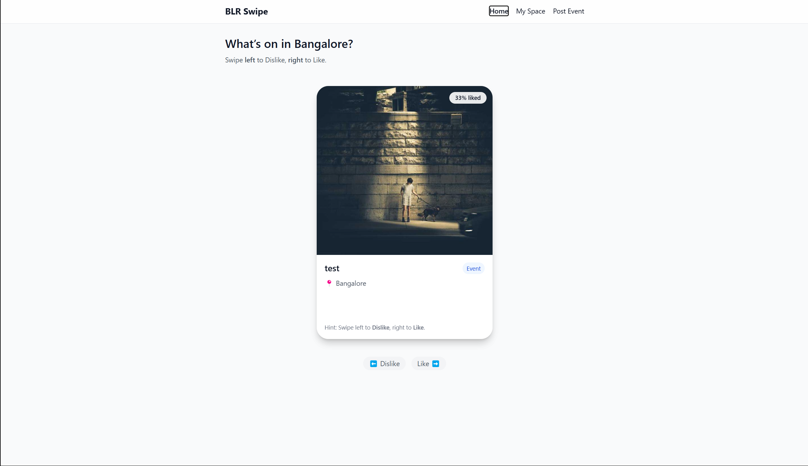

# BLR Swipe - Event Discovery App

---

## ## Key Features

* **Intuitive Card Swiping**: Swipe right to "Like" an event and left to "Dislike," powered by `react-tinder-card` for smooth animations.
* **Personalized User Space**: A "My Space" page that lists all liked and disliked events, giving users a personalized dashboard.
* **Upcoming Event Reminders**: An automated reminder section on the profile page that highlights liked events scheduled for the near future.
* **Event Submission**: A dedicated form for users to post their own events and activities to the platform.
* **Recommendation-Ready Backend**: The like/dislike system is designed as a foundation for a future personalization and recommendation engine.

---

## ## Technologies Used

This project is a full-stack application built with the MERN stack and modern development tools.

* **Frontend**:
    * React
    * TypeScript
    * Vite
    * Tailwind CSS
    * Axios
* **Backend**:
    * Node.js
    * Express
    * TypeScript
    * Mongoose (MongoDB)
    * Dotenv

---

## ## Screenshots

<table>
  <tr>
    <td align="center"><strong>Home (Swiping)</strong></td>
    <td align="center"><strong>My Space (Profile)</strong></td>
  </tr>
  <tr>
    <td></td>
    <td></td>
  </tr>
</table>

---

## ## Local Setup and Installation

To run this project locally, you'll need to have Node.js and MongoDB installed.

### ### Backend Setup

1.  **Navigate to the backend directory:**
    ```bash
    cd blr-swipe-backend
    ```
2.  **Install dependencies:**
    ```bash
    npm install
    ```
3.  **Create a `.env` file** in the backend root and add your database connection string:
    ```env
    MONGO_URI=your_mongodb_connection_string
    ```
4.  **Start the backend server:**
    ```bash
    npm run dev
    ```
    The API will be running on `http://localhost:4000`.

### ### Frontend Setup

1.  **Navigate to the frontend directory:**
    ```bash
    cd blr-swipe-frontend
    ```
2.  **Install dependencies:**
    ```bash
    npm install
    ```
3.  **Create a `.env` file** in the frontend root and point it to your local backend API:
    ```env
    VITE_API_BASE=http://localhost:4000
    VITE_CITY=Bangalore
    ```
4.  **Start the frontend development server:**
    ```bash
    npm run dev
    ```
    The application will be running on `http://localhost:5173`.
